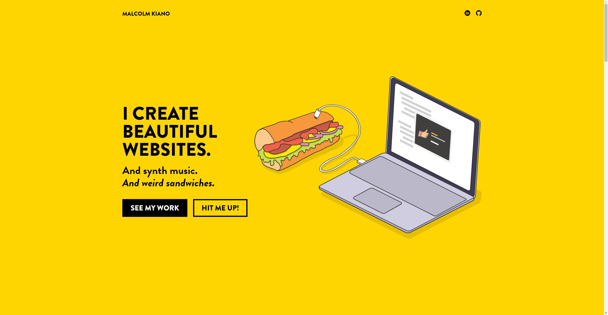

# Portfolio v1

Source code for my personal portfolio.

## Summary

This portfolio highlights my famed illustration of the super secret sandwich analyzer I use to test out my recipes, as well as all of my projects so far.

## Technologies Used:

This version is built on HTML, Sass (compiled to CSS) and JavaScript.

## Contribute

Have any cool ideas for improvements on the visuals/functionality of this app? Want to user this as a starting point for your own portfolio? Feel free to fork this repo or submit a pull request. Excited to see what you create! 🤩 
